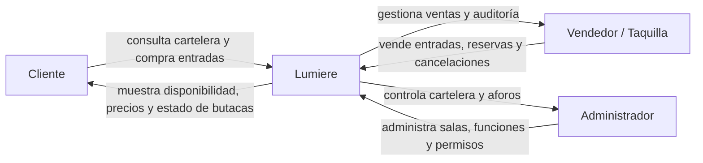
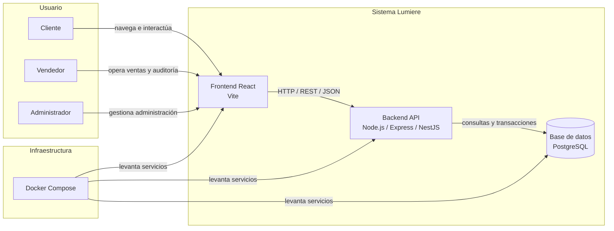
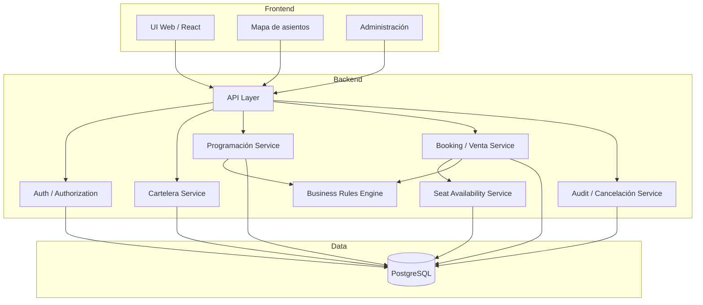

# Modelo C4 — Lumiere

Este documento presenta una versión funcional del modelo C4 para el sistema `Lumiere`, basada en la información disponible en `docs/ficha-del-sistema.md` y `docs/escenarios.md`.

> Nota: se trata de un modelo arquitectónico de referencia, no de una extracción automática del código. Se mantiene fiel a los requisitos y componentes documentados.

## 1. Nivel 1 — Diagrama de contexto

### Descripción

`Lumiere` es un sistema de gestión para cines que permite gestionar la cartelera, vender entradas y controlar la operación de salas y funciones. Los actores principales son:

- Cliente: consulta la cartelera, selecciona butacas y compra entradas.
- Vendedor / taquilla: atiende clientes, tramita ventas y cancelaciones.
- Administrador: gestiona cartelera, salas, funciones y permisos.

### Objetivo

Mostrar la relación del sistema con sus usuarios y los principales flujos de operación del negocio.

## 2. Nivel 2 — Diagrama de contenedores

### Contenedores principales

- Frontend web (React + Vite)
- Backend/API (Node.js + Express/NestJS)
- Base de datos (PostgreSQL)
- Infraestructura de despliegue (Docker Compose)

### Responsabilidades por contenedor

- Frontend:
  - Visualización de cartelera
  - Mapa interactivo de butacas
  - Compra de entradas
  - Panel administrativo

- Backend:
  - Autenticación y autorización
  - Reglas de negocio de ventas y programación
  - Validación de salas, horarios y restricciones por edad
  - Registro de auditoría y operaciones de cancelación

- Base de datos:
  - Persistencia de funciones, salas, asientos, ventas y auditoría
  - Garantía de integridad y control de concurrencia

## 3. Nivel 3 — Diagrama de componentes

### Componentes del backend

### Componentes relevantes

- `Auth / Authorization`: valida usuarios y permisos para empleados y administradores.
- `Cartelera Service`: expone películas y funciones activas.
- `Programación Service`: valida horarios y evita conflictos por limpieza entre funciones.
- `Booking / Venta Service`: gestiona compras, reservas y validación de asientos.
- `Seat Availability Service`: controla estado de butacas y evita overbooking.
- `Audit / Cancelación Service`: guarda quién canceló, cuándo, qué boleto y qué cambios ocurrieron.
- `Business Rules Engine`: centraliza validaciones legales de negocio, por ejemplo:
  - no vender butacas ocupadas o en reserva activa
  - no programar funciones con solapes ni sin margen de limpieza
  - bloquear boletos para menores de edad si la película es +18

## 4. Vista funcional según los escenarios de calidad

Los escenarios documentados se alinean claramente con los componentes anteriores:

- Escenario 1 — Doble venta del mismo asiento
  - relacionado con `Booking / Venta Service` + `Seat Availability Service` + control de concurrencia en base de datos
- Escenario 2 — Cancelación con registro
  - relacionado con `Audit / Cancelación Service` y trazabilidad en la base de datos
- Escenario 3 — Solo administradores en administración
  - relacionado con `Auth / Authorization` y control de permisos
- Escenario 4 — Vender rápido con el mapa de asientos
  - relacionado con `UI`, `Mapa de asientos`, `Booking Service` y usabilidad del flujo de venta
- Escenario 5 — Recuperación ante caída
  - relacionado con disponibilidad del backend, consistencia de datos y recuperación del sistema

## 5. Riesgos arquitectónicos visibles desde el C4

A partir del contexto del proyecto, los puntos más críticos son:

- Concurrencia: dos ventas sobre la misma butaca en el mismo instante.
- Integridad de datos: evitar estados inconsistentes en asientos y ventas.
- Seguridad: control de permisos sobre administración.
- Auditoría: trazabilidad de cancelaciones y modificaciones.
- Disponibilidad: mantener operación continua durante fallas del sistema.

## 6. Conclusión

El modelo C4 para `Lumiere` sugiere una arquitectura centrada en tres capas clave:

1. Frontend para la experiencia de venta y administración
2. Backend con servicios de negocio y control de autorización
3. Base de datos relacional con reglas de integridad y trazabilidad

Esto encaja con los objetivos de negocio descritos en la ficha del sistema y con los escenarios de calidad priorizados en `docs/escenarios.md`.
